<div align="center">
  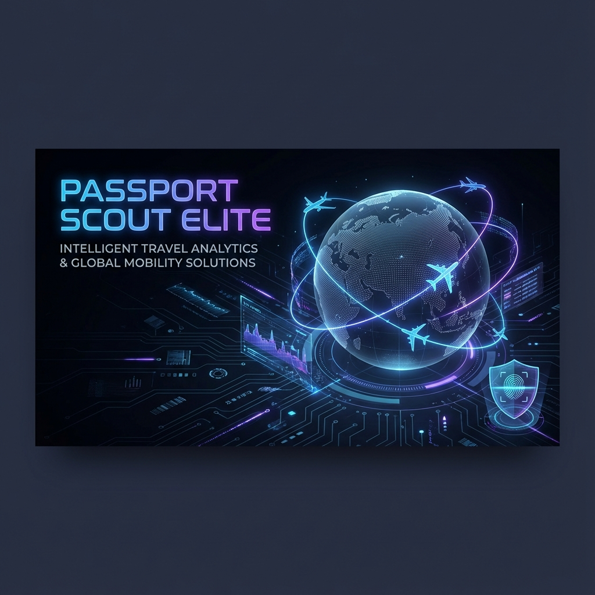

  <br />

  # Passport Scout Elite

  <p align="center">
    <b>The Ultimate AI-Powered Data Assistant for Modern Travel Agents</b>
  </p>

  <p align="center">
    Automate extraction, streamline bookings, and eliminate manual data entry errors.
  </p>

</div>

---

## 🌟 Why Passport Scout?

**Passport Scout Elite** is not just an OCR tool; it's a complete workflow automation engine designed for high-volume travel agents. By combining Google's advanced **Gemini AI** with a universal auto-fill bookmarklet, it bridges the gap between raw passport data and complex booking portals.

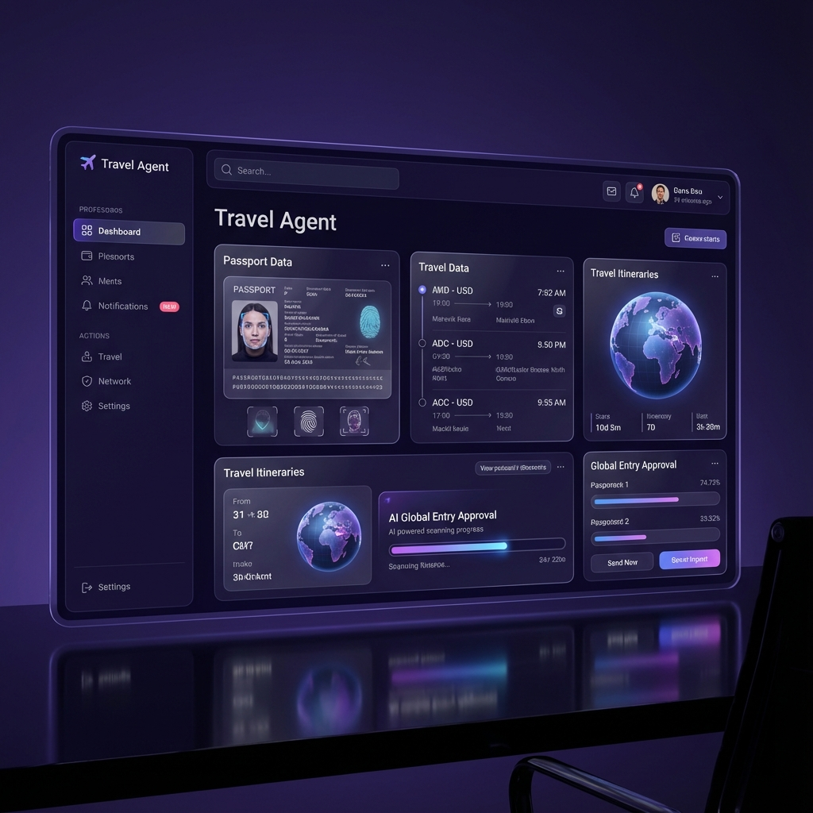

---

## ✨ Key Features

### 🧠 AI Vision Extraction
Powered by **Google Gemini**, our engine goes beyond simple text recognition. It understands context, accurately identifying fields like Gender, Date of Birth, and Nationality even from low-quality images.

<div align="center">
  
</div>

### 🔖 Universal Auto-Fill Engine
Forget copying and pasting. Our smart bookmarklet injects data directly into any web form. Whether it's Expedia, MakeMyTrip, or a custom B2B portal, Passport Scout adapts to the diverse HTML structures of the web.

<div align="center">
  
</div>

<br/>

| Feature | Description |
| :--- | :--- |
| **🔄 Smart Scaling** | Automatically clicks **"+ ADD ADULT"** buttons if your passenger list exceeds the current rows. |
| **💾 Cloud Sync** | Integrated with **Supabase** to securely save trips and manifests for cross-device access. |
| **📑 Excel Export** | Generate professional **Excel manifests** for visa processing and group bookings. |
| **🧪 Safe Sandbox** | Includes a built-in **Portal Sandbox** to test your workflows before accessing live booking sites. |

---

## 🚀 Quick Start Guide

### 1. Installation & Environment

Make sure you have **Node.js (v16+)** installed.

```bash
# Clone the repository
git clone https://github.com/your-username/Passport-Scout-Elite-Agent.git
cd Passport-Scout-Elite-Agent

# Install dependencies
npm install
```

Create a `.env` file in the root directory:

```env
VITE_GEMINI_API_KEY=your_google_gemini_key
VITE_SUPABASE_URL=your_supabase_url
VITE_SUPABASE_ANON_KEY=your_supabase_anon_key
```

### 2. Launch the Application

```bash
npm run dev
```
Visit `http://localhost:5173` to start your session.

---

## 📸 Visual Walkthrough

## 📸 Visual Walkthrough

### 1. Upload Documents
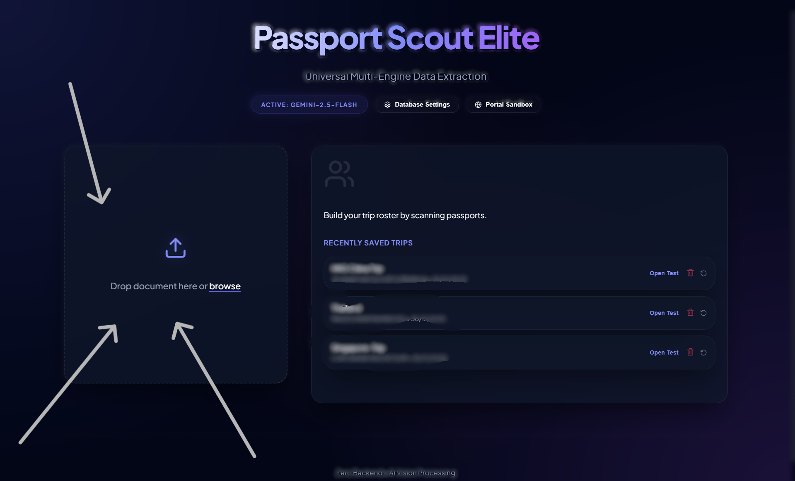
Begin by dragging and dropping your passport image into the upload zone. The app is ready to accept your documents for secure processing.

### 2. AI Extraction & Storage
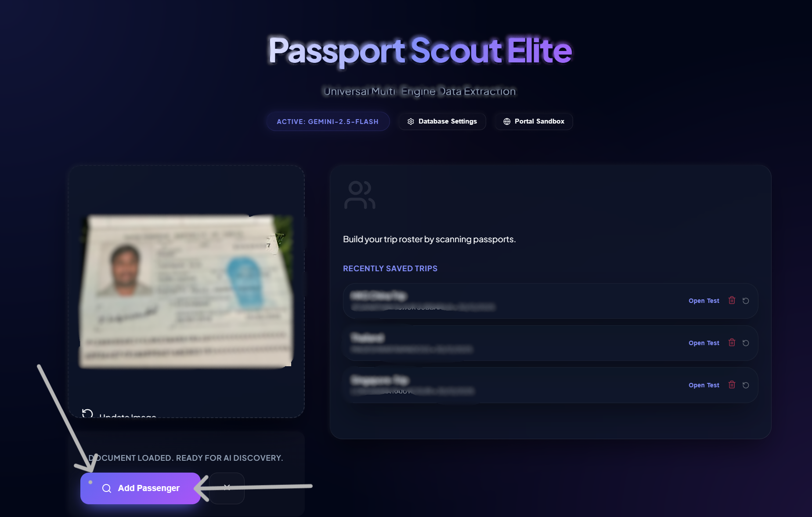
Click **"Add Passenger"** to trigger the Gemini AI engine. It instantly extracts details, parses them into JSON, and securely stores the passenger in your database.

### 3. Get the Magic Tool
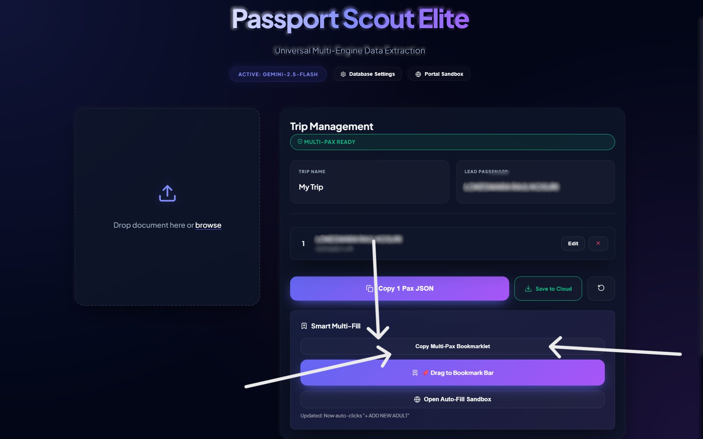
Click the **"Copy Multi-Pax Bookmarklet"** button to grab the smart script needed to auto-fill forms on external portals. Alternatively, drag the **"Drag to Bookmark Bar"** button directly to your browser's bar.

### 4. Create Bookmark
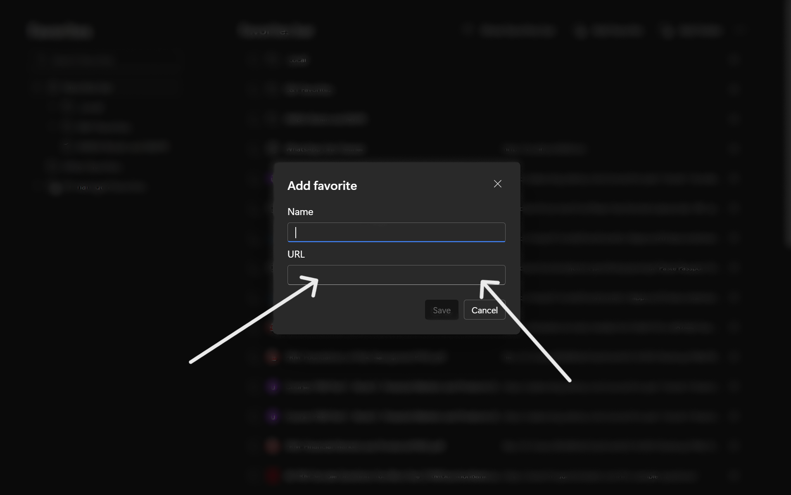
In your browser, right-click your bookmarks bar and select **"Add Page"**. Give it a recognizable name like **"AI Auto-Fill"**.

### 5. Install Script
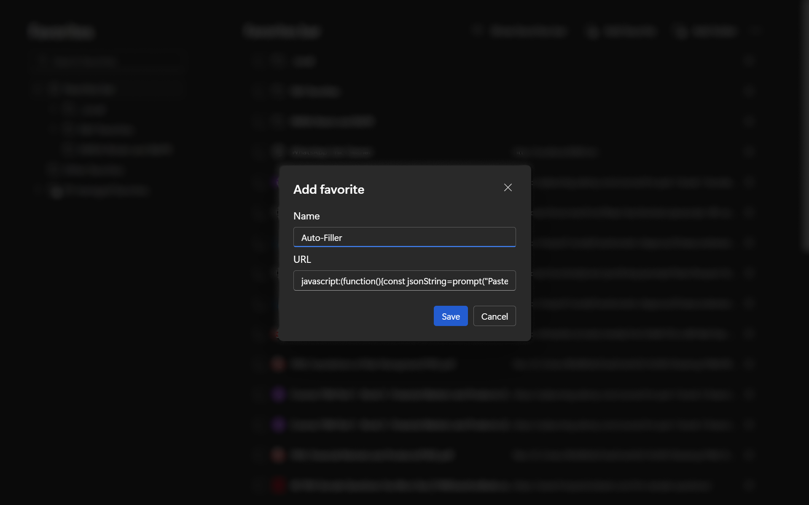
Paste the copied code into the bookmark's **URL** field. This one-time setup bridges the app with any website.

### 6. Enter the Sandbox
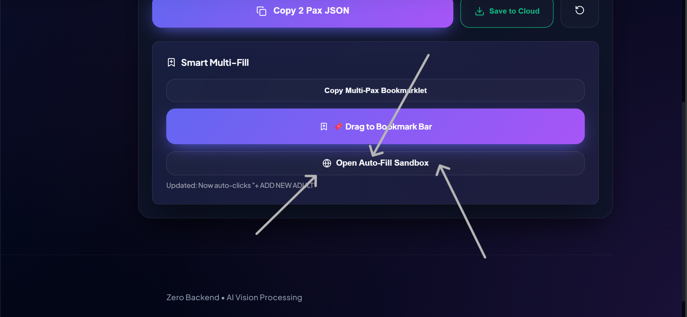
Click **"Open Auto-Fill Sandbox"**. This launches a safe, simulated booking environment where you can test the functionality before going live (or check if your bookmarklet is installed correctly).

### 7. Activate on Portal
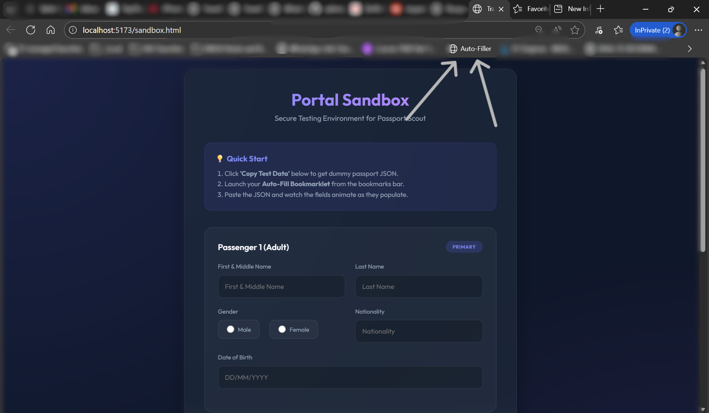
While on the Sandbox (or any real booking site), click your newly created **"AI Auto-Fill"** bookmark to initiate the process.

### 8. Retrieve Data
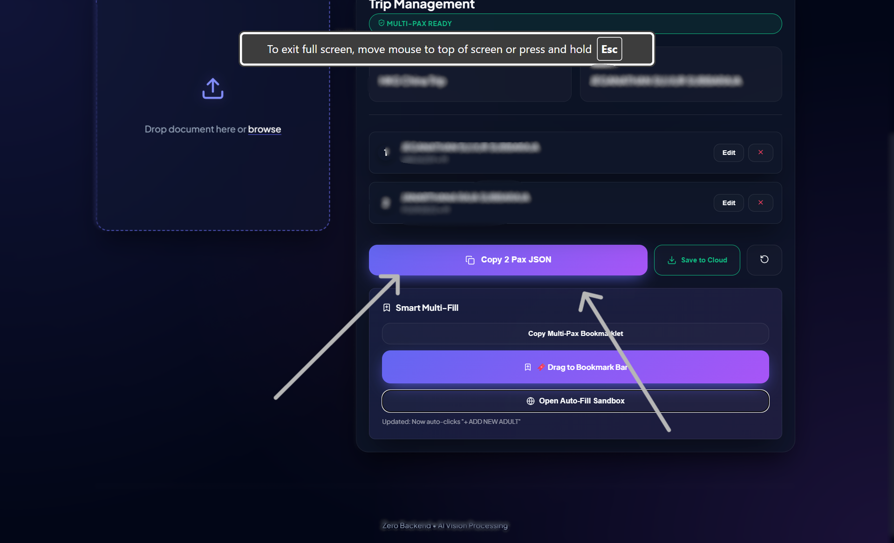
Back in the dashboard, click **"Copy Pax JSON"**. This copies your entire group's extracted manifest to your clipboard.

### 9. Instant Fulfillment
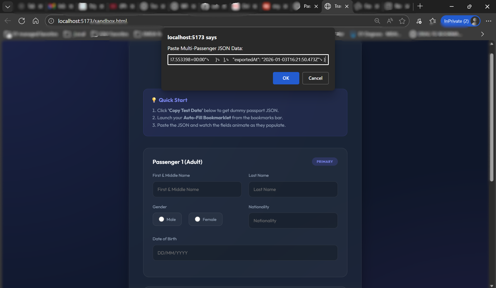
Paste the JSON into the prompt that appears after clicking the bookmarklet. Watch as names, dates, and passport numbers are **magically populated** into the form fields.


---

## 🛠️ Technical Specs

### Supported Data Fields

| Field | Source Key | Extraction Logic |
| :--- | :--- | :--- |
| **First Name** | `names` | Smart label & name matching |
| **Last Name** | `surname` | Surname separation & validation |
| **Gender** | `sex` | Normalizes to `MALE` / `FEMALE` |
| **Nationality** | `nationality` | ISO Standard & Dropdown matching |
| **Date of Birth** | `dob` | Multi-format date parsing |

### Universal Portal Support
The auto-fill script handles:
*   ✅ Standard HTML `<input>` fields
*   ✅ Dynamic React/Next.js forms
*   ✅ Complex nested layouts
*   ✅ Multi-passenger rows (`.paxDetails`)

---

## 🔐 Privacy & Security

*   **Local Processing**: Your API keys stay in your environment.
*   **Zero Image Storage**: Passport images are processed in memory and never saved to our servers unless explicitly synced to your private Supabase.

---

<div align="center">
  <i>“Optimized for B2B Travel Portals. Built for the Elite Agent.”</i>
</div>

---

## 📄 License

Distributed under the MIT License. See `LICENSE` for more information.

